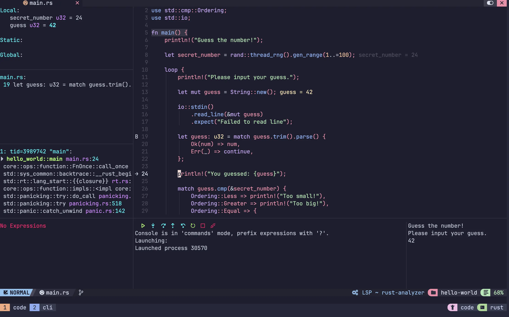

# neovim-rust
It's a minimal nvchad `v2.0` configuration for rust lang.

## Showcase

### Plugins
Configuration includes:
- Formatter - `rust-lang/rust`
- Rust LSP - `rust-analyzer`, `rustaceanvim`
- Debugging tools - `dap`, `dap-ui`, `dap-virtual-text`

#### Debugging
Do not forget install codelldb via mason `:MasonInstall codelldb`.

You have options to start debugging through `hover actions` or `<leader>dd`.

#### Key bindings
There are preconfigured [key bindins](./custom/mappings.lua).
